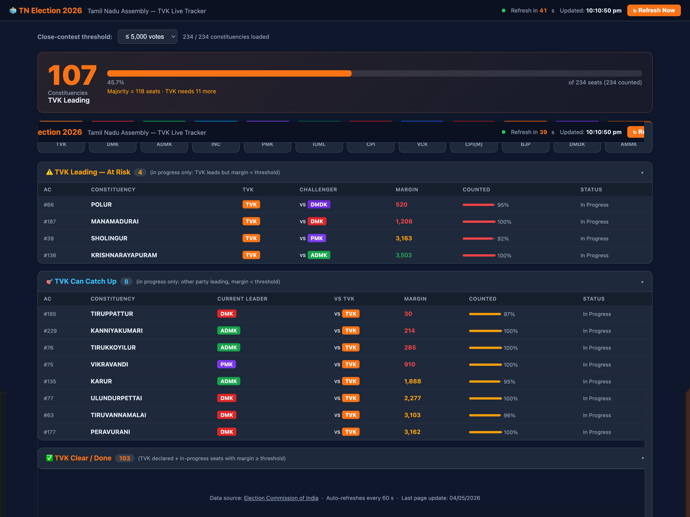

# Tamil Nadu Assembly Election 2026 – Live Results Dashboard



A real-time dashboard that scrapes and visualises live counting results for all 234 Tamil Nadu Assembly constituencies from the Election Commission of India (ECI) website.

## Features

- **Live data** scraped from `results.eci.gov.in` every 60 seconds
- **Party-wise seat tally** across all major parties (TVK, DMK, ADMK, BJP, INC, PMK, etc.)
- **Per-constituency breakdown** — leading/trailing party, vote margin, counting rounds progress, and result status
- **TVK-focused tracker** — highlights Tamilaga Vettri Kazhagam (TVK) seats prominently
- Uses **Puppeteer + system Chrome** to bypass Akamai bot-protection on the ECI site

## Prerequisites

- **Node.js 18+**
- **Google Chrome** installed at `/Applications/Google Chrome.app` (macOS default path)

## Installation

```bash
npm install
```

## Usage

```bash
npm start
# or
node server.js
```

Then open [http://localhost:3000](http://localhost:3000) in your browser.

## API Endpoints

| Endpoint | Description |
|---|---|
| `GET /api/data` | Returns cached results (refreshes if cache is older than 60 s) |
| `GET /api/refresh` | Forces an immediate re-scrape from ECI |

### Example response

```json
{
  "constituencies": [
    {
      "name": "Chepauk-Thiruvallikeni",
      "ac": 5,
      "leadingParty": "DMK",
      "trailingParty": "ADMK",
      "margin": 12345,
      "roundsDone": 10,
      "roundsTotal": 14,
      "completionPct": 71,
      "status": "In Progress"
    }
  ],
  "partySummary": { "DMK": 120, "TVK": 60, "ADMK": 30 },
  "total": 234,
  "timestamp": "2026-05-04T10:30:00.000Z",
  "loading": false
}
```

## Project Structure

```
├── server.js          # Node HTTP server + Puppeteer scraper
├── debug-parties.js   # Utility script for debugging party name parsing
├── public/
│   └── index.html     # Single-page dashboard UI
└── package.json
```

## How It Works

1. On first request (or after the 60 s TTL), the server spins up a headless Chrome instance via `puppeteer-core`.
2. It fetches all 12 ECI constituency-list pages (`statewiseS22{1-12}.htm`), spoofing browser headers to avoid bot-detection.
3. Each page's DOM is queried directly in the browser context to handle ECI's nested-table layout.
4. Results are deduplicated by AC number, party names are normalised to short abbreviations, and the data is cached.
5. The dashboard UI polls `/api/data` and renders a live-updating table and party summary.

## Notes

- The Chrome path is hardcoded for macOS (`/Applications/Google Chrome.app/Contents/MacOS/Google Chrome`). Update `CHROME_PATH` in `server.js` if you are on Linux or Windows.
- ECI data is only available during the official counting period.

## License

MIT
